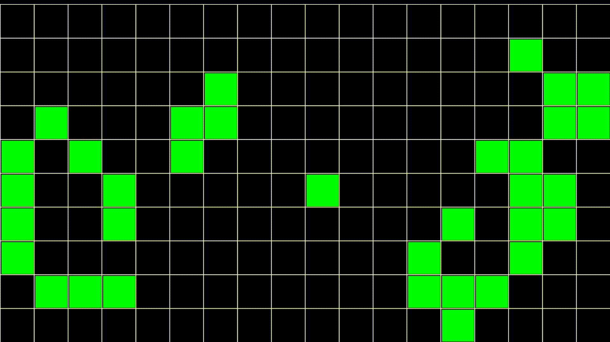
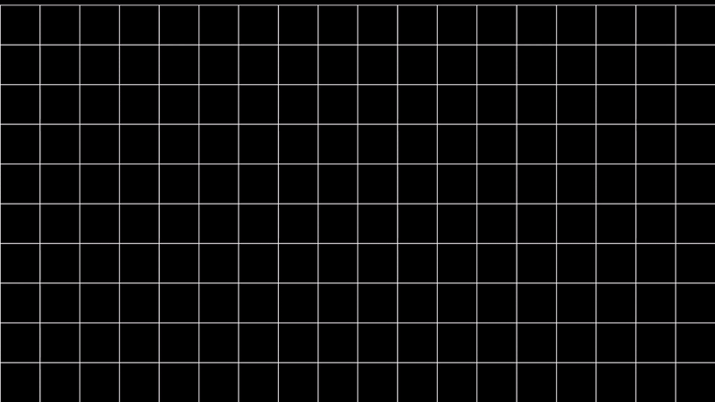

# Игра жизнь

### Запуск

``
python main.py <width> <height> -cs <cell_size> -s <speed>
``

- width - обязательный аргумент - ширина поля
- height - обязательный аргумент - высота поля
- cell_size - не обязательный аргумент - размер одной клетки
- speed - не обязательный аргумент - скорость игры

### Hotkeys

- **q** - выйти
- **space** - остановить игру, дальнейшие действия возможны только на паузе
- **s** / **l** - сохранить/загрузить игру
- **c** - очистить поле
- **r** - очистить поле и случайно сгенерировать новое
- **n** | **"right_arrow"** - перейти на следующую итерацию
- **p** | **"left_arrow"** - перейти на предыдущую итерацию(возможен переход только на *предыдущую* итерацию, при
  последующем нажатии будет произведен возврат на текущую)
- **ЛКМ** - изменить состояние клетки(с живого на мертвое и обратно)
- **f** - включить режим закрашивания: каждая клетка, где находится курсор, будет закрашена в соответствии с режимом
  закраски
- **m** - изменить режим закраски: по умолчанию закрашивает живыми клетками

### Примеры игры

Демонстрация возможностей приложения

пауза игры, \
закрашивание/очистка клеток по клику и по позиции курсора, \
очищение поля, \
создание случайного поля, \ 
перемотка состояний стрелочками, \
увеличение/уменьшение скорости игры

загрузка из файла состояния игры, \
сохранение в файл состояния игры
